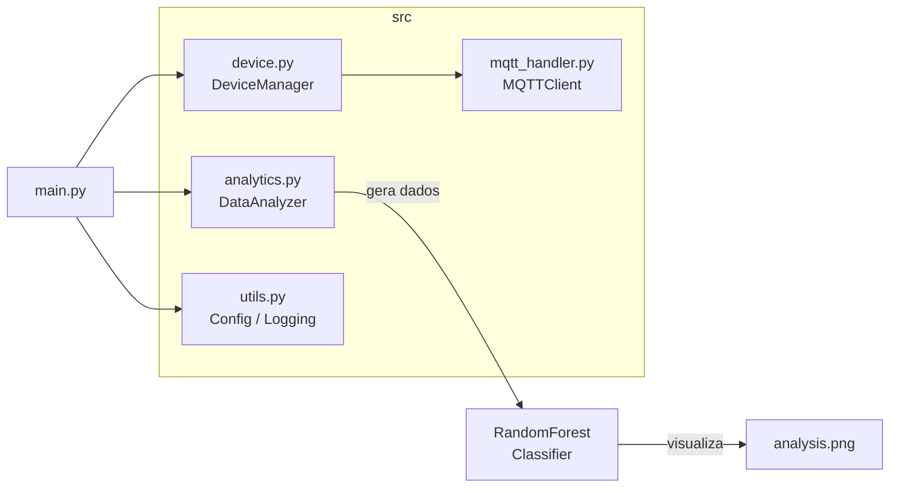
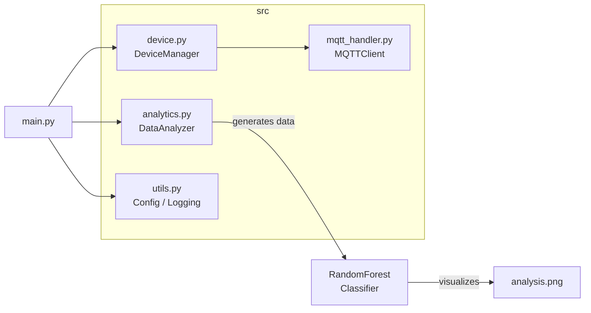

# IoT Data Processing System

[](https://www.python.org/)
[](https://scikit-learn.org/)
[](https://eclipse.dev/paho/)
[](LICENSE)

[Portugues](#portugues) | [English](#english)

---

## Portugues

### Visao Geral

Demo em Python para processamento de dados IoT. Inclui gerenciamento de dispositivos, cliente MQTT para comunicacao com broker, e um pipeline de analytics com RandomForest para classificacao de dados de sensores.

### Arquitetura



### Modulos

| Modulo | Descricao |
|--------|-----------|
| `src/device.py` | Classes `Device` e `DeviceManager` para registro e controle de status de dispositivos IoT |
| `src/mqtt_handler.py` | Wrapper do cliente MQTT (paho-mqtt) para comunicacao com broker |
| `src/analytics.py` | `DataAnalyzer` — gera dados de sensores sinteticos, treina RandomForest, gera visualizacoes |
| `src/utils.py` | Carregamento de config YAML e configuracao de logging |
| `main.py` | Ponto de entrada — integra todos os modulos acima |

### Inicio Rapido

```bash
git clone https://github.com/galafis/IoT-Data-Processing-System.git
cd IoT-Data-Processing-System

python -m venv venv
source venv/bin/activate  # Windows: venv\Scripts\activate

pip install -r requirements.txt
python main.py
```

### Testes

```bash
pytest tests/ -v
```

### Estrutura do Projeto

```
IoT-Data-Processing-System/
├── src/
│   ├── __init__.py
│   ├── analytics.py
│   ├── device.py
│   ├── mqtt_handler.py
│   └── utils.py
├── tests/
│   ├── __init__.py
│   └── test_analytics.py
├── main.py
├── requirements.txt
├── LICENSE
└── README.md
```

### Autor

**Gabriel Demetrios Lafis**
- GitHub: [@galafis](https://github.com/galafis)
- LinkedIn: [Gabriel Demetrios Lafis](https://linkedin.com/in/gabriel-demetrios-lafis)

### Licenca

MIT — veja [LICENSE](LICENSE).

---

## English

### Overview

Python demo for IoT data processing. Includes device management, an MQTT client wrapper for broker communication, and an analytics pipeline with RandomForest for sensor data classification.

### Architecture



### Modules

| Module | Description |
|--------|-------------|
| `src/device.py` | `Device` and `DeviceManager` classes for IoT device registration and status tracking |
| `src/mqtt_handler.py` | MQTT client wrapper (paho-mqtt) for broker communication |
| `src/analytics.py` | `DataAnalyzer` — generates synthetic sensor data, trains a RandomForest classifier, produces visualizations |
| `src/utils.py` | YAML config loading and logging setup |
| `main.py` | Entry point — integrates all modules above |

### Quick Start

```bash
git clone https://github.com/galafis/IoT-Data-Processing-System.git
cd IoT-Data-Processing-System

python -m venv venv
source venv/bin/activate  # Windows: venv\Scripts\activate

pip install -r requirements.txt
python main.py
```

### Tests

```bash
pytest tests/ -v
```

### Project Structure

```
IoT-Data-Processing-System/
├── src/
│   ├── __init__.py
│   ├── analytics.py
│   ├── device.py
│   ├── mqtt_handler.py
│   └── utils.py
├── tests/
│   ├── __init__.py
│   └── test_analytics.py
├── main.py
├── requirements.txt
├── LICENSE
└── README.md
```

### Author

**Gabriel Demetrios Lafis**
- GitHub: [@galafis](https://github.com/galafis)
- LinkedIn: [Gabriel Demetrios Lafis](https://linkedin.com/in/gabriel-demetrios-lafis)

### License

MIT — see [LICENSE](LICENSE).
