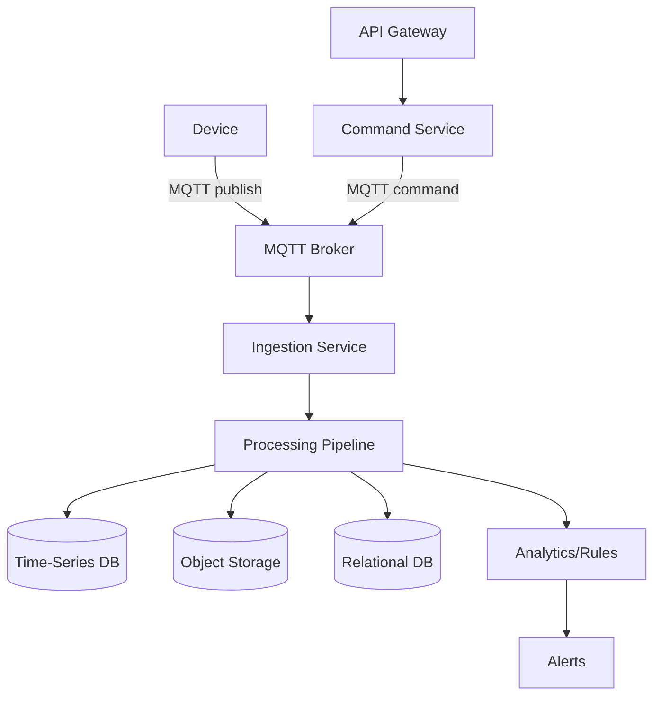
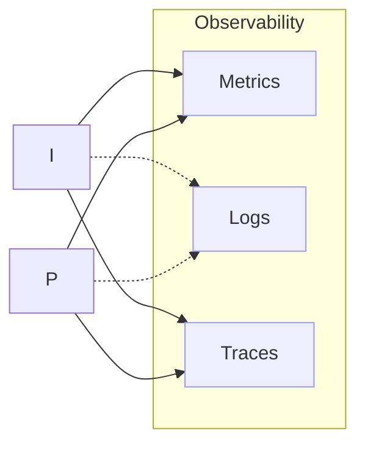

# IoT Data Processing System Documentation

This documentation describes the system API, architecture, configuration formats (YAML/JSON), MQTT schema, data flows, design conventions, and best practices for implementing and extending the platform.

## Contents
- Architecture overview
- Data flow diagrams
- MQTT topic schema and payloads
- External API endpoints (ingest, control, health)
- Configuration (YAML/JSON) examples
- Processing pipeline (ingestion, validation, enrichment, storage, analytics)
- Error handling and observability
- Security and compliance
- Design conventions and best practices

---

## 1) Architecture Overview
The system is composed of the following services/components:
- Edge Devices: Publish telemetry and receive commands via MQTT.
- MQTT Broker: Decouples device communication. Supports QoS, retained messages, and ACLs.
- Ingestion Service: Subscribes to MQTT topics, validates payloads, enriches metadata, and forwards events to the processing pipeline.
- Processing Pipeline: Applies transformations, filtering, windowed aggregations, and anomaly detection.
- Storage Layer: Time-series DB (e.g., InfluxDB/Timescale) for metrics; object storage for raw payload archives; relational DB for metadata/config.
- API Gateway: Exposes RESTful endpoints for ingestion (optional HTTP), device control, and health checks.
- Analytics/Rules Engine: Real-time alerts, thresholds, and rules evaluation.
- Dashboard/Monitoring: Metrics, traces, and logs (OpenTelemetry compatible).

Deployment can be monolithic (single process) for demos, or microservices for production. All components communicate via well-defined interfaces (MQTT, HTTP/REST, and internal queues if enabled).

---

## 2) Data Flow (Diagrams)

High-level runtime flow:

Device -> MQTT Broker -> Ingestion Service -> Processing Pipeline -> Storage/Analytics -> APIs/Dashboards

Control flow:

API -> Command Service -> MQTT Broker -> Device

Error flow:

Any component -> Error Channel -> DLQ/Retry -> Alerting

You can render the following Mermaid diagrams locally or in supported viewers:





---

## 3) MQTT Topic Schema and Payloads

Topic namespaces follow: `iot/{tenant}/{deviceId}/{stream}`
- tenant: Organization/workspace identifier
- deviceId: Unique device identifier (UUID, MAC, or serial mapped in registry)
- stream: telemetry | state | command | ack

Examples:
- Telemetry publish: `iot/acme/edge-001/telemetry`
- State publish: `iot/acme/edge-001/state`
- Command subscribe (device listens): `iot/acme/edge-001/command`
- Command ack (device publishes): `iot/acme/edge-001/ack`

QoS recommendations:
- Telemetry: QoS 1
- State: QoS 1 with retained messages
- Command: QoS 1 or 2 depending on criticality
- Ack: QoS 1

Payload JSON schema (telemetry):
```json
{
  "deviceId": "edge-001",
  "ts": "2025-09-30T10:24:00Z",
  "metrics": {
    "temp_c": 23.5,
    "humidity_pct": 61.2,
    "battery_pct": 98
  },
  "tags": {
    "site": "BR-SP-01",
    "firmware": "1.2.3"
  }
}
```

Payload JSON schema (command from cloud to device):
```json
{
  "cmdId": "7b8d1e3f",
  "action": "set_interval",
  "params": { "seconds": 30 },
  "ts": "2025-09-30T10:24:10Z"
}
```

Ack example:
```json
{
  "cmdId": "7b8d1e3f",
  "status": "ok",
  "ts": "2025-09-30T10:24:11Z",
  "details": null
}
```

---

## 4) External API Endpoints (REST)
Base path: `/api/v1`

- POST `/ingest`
  - Description: HTTP alternative to MQTT. Accepts telemetry payloads.
  - Body: telemetry JSON as above
  - Response: 202 Accepted

- POST `/devices/{deviceId}/commands`
  - Description: Schedules a command to device via MQTT
  - Body: command JSON as above
  - Response: 202 Accepted with `cmdId`

- GET `/health`
  - Liveness/readiness for container orchestration

- GET `/metrics`
  - Prometheus format metrics if enabled

Auth: Bearer tokens via `Authorization: Bearer <token>`; support for mTLS optional.

---

## 5) Configuration (YAML/JSON)

YAML example (`config.yaml`):
```yaml
app:
  env: production
  log_level: INFO
  timezone: UTC

mqtt:
  host: broker.local
  port: 8883
  tls:
    enabled: true
    ca_file: /etc/ssl/certs/ca.pem
    cert_file: /etc/iot/client.crt
    key_file: /etc/iot/client.key
  auth:
    username: ${MQTT_USER}
    password: ${MQTT_PASS}
  topics:
    telemetry: "iot/${tenant}/${deviceId}/telemetry"
    state: "iot/${tenant}/${deviceId}/state"

pipeline:
  validation:
    required_fields: [deviceId, ts, metrics]
  enrichment:
    add_hostname: true
    default_tags:
      source: cloud
  transforms:
    - type: unit_convert
      field: metrics.temp_c
      to: temp_f
    - type: clamp
      field: metrics.humidity_pct
      min: 0
      max: 100
  storage:
    timeseries:
      engine: timescale
      dsn: postgresql://iot:***@db:5432/iot
    raw_archive:
      bucket: iot-raw
      path_template: "${tenant}/${deviceId}/%Y/%m/%d/%H/%M.json"

api:
  enable_http_ingest: true
  bind: 0.0.0.0:8080
  auth:
    jwt_issuer: https://issuer.example.com
    jwks_url: https://issuer.example.com/.well-known/jwks.json
```

JSON example (`config.json`):
```json
{
  "app": {"env": "dev", "log_level": "DEBUG", "timezone": "UTC"},
  "mqtt": {"host": "localhost", "port": 1883, "tls": {"enabled": false}},
  "pipeline": {"validation": {"required_fields": ["deviceId", "ts", "metrics"]}},
  "api": {"enable_http_ingest": true, "bind": "0.0.0.0:8080"}
}
```

Environment variable expansion `${VAR}` is supported; secrets should be loaded from a vault or container runtime secrets.

---

## 6) Processing Pipeline

Stages:
- Validation: schema, required fields, value ranges
- Enrichment: timestamps, host info, geotags, tenant mapping
- Transformations: unit conversion, normalization, feature engineering
- Routing: topic-based or attribute-based routing to sinks
- Sinks: time-series DB, object storage, pub/sub
- Analytics: rules and anomaly detection (e.g., z-score, EWMA)

Retry & DLQ:
- Transient errors: exponential backoff with jitter
- Poison messages: move to DLQ bucket/table with reason and trace

Idempotency: use `eventId` or `(deviceId, ts)` composite key.

---

## 7) Error Handling and Observability

- Structured logging (JSON) with correlation IDs
- Metrics: throughput, latency, error rates, backlog size
- Tracing: OpenTelemetry context propagated via MQTT user properties (if supported) or HTTP headers
- Health checks: `/health` and dependency checks (broker, DB)
- Alerting: thresholds on error rate, broker disconnects, lag, and DLQ growth

---

## 8) Security and Compliance

- TLS everywhere (MQTT over TLS 1.2+, HTTPS)
- Device authentication: per-device credentials or mutual TLS
- Authorization: tenant-bound topic ACLs, principle of least privilege
- Payload security: validate against JSON schema; limit size; sanitize tags
- Secrets management: external vault, rotate regularly
- Compliance: audit logging, PII handling, data retention policies

---

## 9) Design Conventions and Best Practices

- Code style: PEP 8, type hints, docstrings; black/ruff for formatting/linting
- Project structure: src/ for code, tests/ for unit tests, docs/ for documentation
- Configuration first: no hard-coded values; 12-factor principles
- Dependency management: pinned versions, requirements.txt/lock files; renovate/bot updates
- Testing: unit + integration; mock broker/db for CI; coverage targets >= 85%
- CI/CD: lint, test, security scans, SBOM, signed artifacts
- Performance: backpressure handling, batching, async I/O
- Resilience: circuit breakers, timeouts, retries, idempotency keys
- Documentation: update this docs/README.md with changes; keep examples runnable

---

## 10) Quick Start (Docs)

- Configure `config.yaml` with your broker/DB settings
- Run: `python main.py --config config.yaml`
- Publish sample telemetry to `iot/demo/device-001/telemetry`
- Use `/metrics` to observe pipeline stats and `/health` for readiness

---

Maintainer: Gabriel Demetrios Lafis

